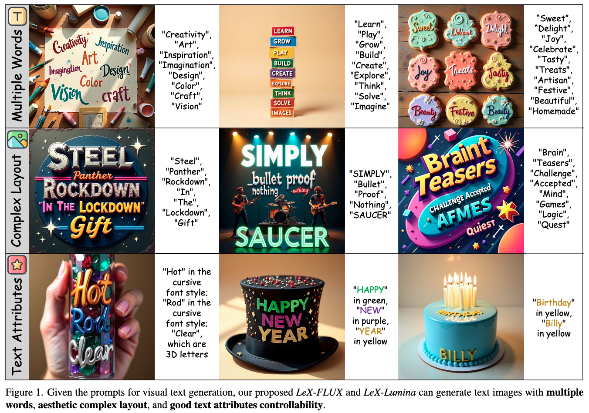
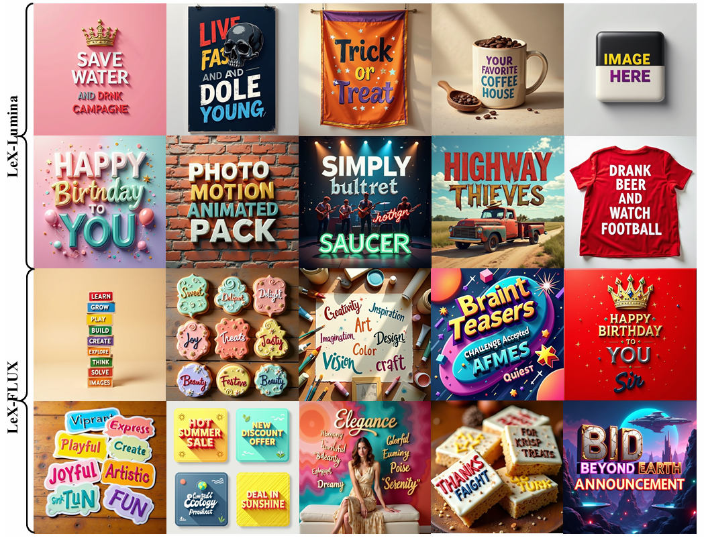
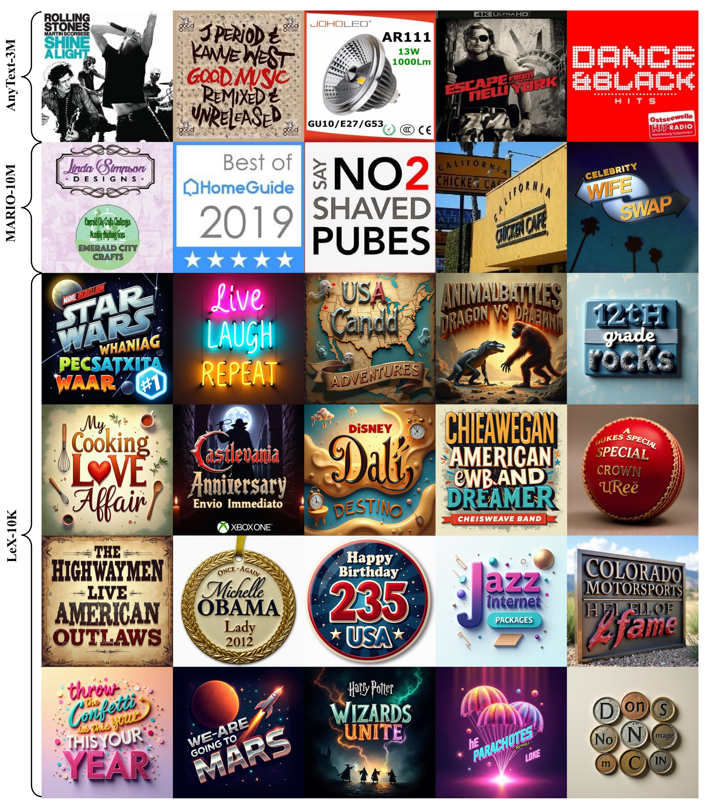
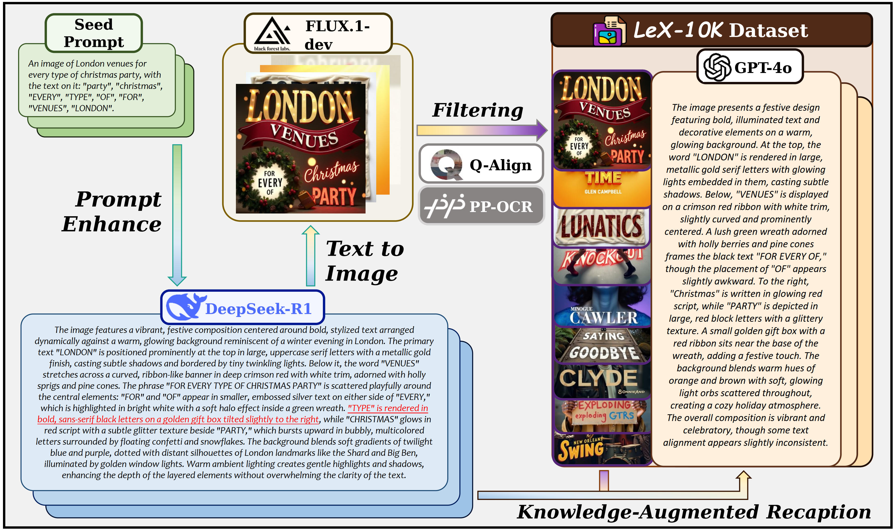
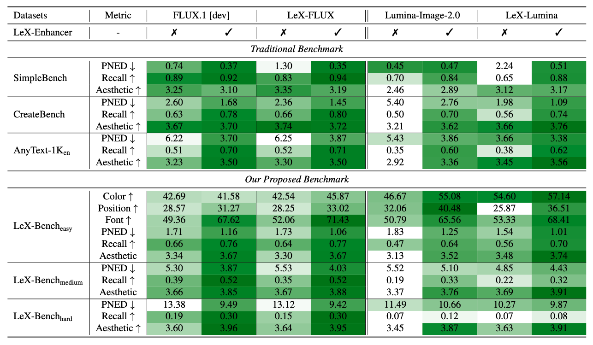

<div align="center">


# LeX-Art: Rethinking Text Generation via Scalable High-Quality Data Synthesis.

[[Paper](https://arxiv.org/pdf/2503.21749)] &emsp; [[Project Page](https://zhaoshitian.github.io/lexart/)] &emsp; 

[[🤗LeX-Enhancer (Model)](https://huggingface.co/X-ART/LeX-Enhancer-full)] &emsp; [[🤗LeX-Lumina (Model)](https://huggingface.co/X-ART/LeX-Lumina)] &emsp; [[🤗LeX-10K (Data)](https://huggingface.co/datasets/X-ART/LeX-Data-10K)]  &emsp; [[🤗LeX-Bench (Benchmark)](https://huggingface.co/datasets/X-ART/LeX-Bench)] <br>

</div>

This is the official repository for **LeX-Art: Rethinking Text Generation via Scalable High-Quality Data Synthesis**.

### 🌠  **Key Features:**

1. Proposed **LeX-Art**, a system bridging prompt expressiveness and text rendering fidelity.
2. Curated **LeX-10K**, a dataset of 10K high-resolution (1024×1024) aesthetically refined images.
3. Developed **LeX-Enhancer** for prompt enrichment and trained two text-to-image models, **LeX-FLUX** and **LeX-Lumina**.
4. Introduced **LeX-Bench** for evaluating fidelity, aesthetics, and alignment, along with the **Pairwise Normalized Edit Distance (PNED) metric** for text accuracy.


## 🎤 Introduction

Generating visually appealing and accurate text within images is challenging due to the difficulty of balancing text fidelity, aesthetic integration, and stylistic diversity. To address this, we introduce **LeX**, a framework that enhances text-to-image generation through **LeX-Enhancer**, a 14B-parameter prompt optimizer, and **LeX-10K**, a high-quality dataset. Using this, we train **LeX-Flux (12B)** and **LeX-Lumina (2B)**, achieving state-of-the-art performance. We also propose **LeX-Bench** and **PNED**, a novel metric for evaluating text correctness and aesthetics. Experiments show **LeX-Lumina** achieving a **79.81\%** PNED gain on CreateBench, and **LeX-FLUX** outperforming baselines in color (+3.18\%), positional (+4.45\%), and font accuracy (+3.81\%).

## 📬 News

- ✅ March 27, 2025. 💥 We release **LeX-Art**, including:
  - Checkpoints, Inference and Evaluate code.
  - Website.


## 🔥 Gallery

### Demos





### Samples from LeX-10K




## 📁 Data Synthesis




## 📊 Experimental Results



## 🚀 Getting Started

### 🛠️ Installation

```bash
git clone https://github.com/zhaoshitian/LeX-Art.git
cd LeX-Art
conda create -n lex python=3.10

# if cuda version == 12.1
pip install torch==2.4.0 torchvision==0.19.0 --index-url https://download.pytorch.org/whl/cu121
pip install git+https://github.com/huggingface/diffusers.git
pip install transformers
```


### 🔍 Inference

We provide multiple tools for inference, tailored to different tasks:

- **[LeX-Enhancer](https://github.com/zhaoshitian/LeX-Art/blob/main/LeX-Enhancer/README.md)**: A tool designed to enhance prompts for improved text-to-image generation.
- **[LeX-Lumina](https://github.com/zhaoshitian/LeX-Art/blob/main/LeX-Lumina/README.md)**: A text-to-image (T2I) model further trained on Lumina-Image-2.0, capable of generating high-quality images with precise text rendering from prompts.
- **[LeX-FLUX](https://github.com/zhaoshitian/LeX-Art/blob/main/LeX-FLUX/README.md)**: A text-to-image (T2I) model further trained on FLUX.1, capable of generating high-quality images with precise text rendering from prompts.

Click on the links above for detailed instructions on how to use each tool.


### 📊 Evaluation

For detailed instructions on model evaluation, please refer to the [Evaluation README](https://github.com/zhaoshitian/LeX-Art/blob/main/evaluation/README.md).


## 📌 Open-source Plan

- [x] Release the inference code.
- [x] Release the evaluation code.
- [x] Release the data and checkpoints for LeX Series.
- [x] Release the training code for LeX-Lumina.
- [ ] Release the training code for LeX-FLUX.

## 📚 BibTeX

If you find LeX-Art useful for your research and applications, please cite using this BibTeX:

```BibTeX
@article{zhao2025lexart,
    title={LeX-Art: Rethinking Text Generation via Scalable High-Quality Data Synthesis},
    author={Zhao, Shitian and Wu, Qilong and Li, Xinyue and Zhang, Bo and Li, Ming and Qin, Qi and Liu, Dongyang and Zhang, Kaipeng and Li, Hongsheng and Qiao, Yu and Gao, Peng and Fu, Bin and Li, Zhen},
    journal={arXiv preprint arXiv:2503.21749},
    year={2025}
}
```

## 🙏 Acknowledgements

Our work is primarily built upon 
[FLUX](https://github.com/black-forest-labs/flux), 
[Lumina-Image-2.0](https://github.com/Alpha-VLLM/Lumina-Image-2.0), 
[Qwen](https://github.com/QwenLM/Qwen2.5), 
[DeepSeek](https://github.com/deepseek-ai/DeepSeek-R1), 
[sd-scripts](https://github.com/kohya-ss/sd-scripts), etc.
We extend our gratitude to all these authors for their significant contributions to the community.
