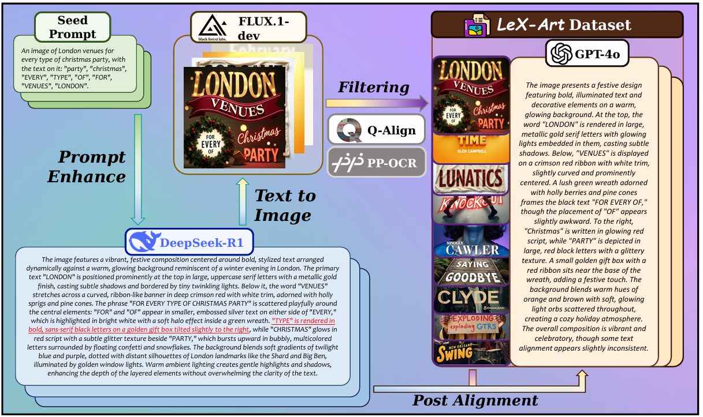

# LeX-Art

## Installation
```bash
git clone https://github.com/zhaoshitian/LeX-Art.git
cd LeX-Art
conda create -n lex python=3.10
# if cuda version == 12.1
pip install torch==2.4.0 torchvision==0.19.0 --index-url https://download.pytorch.org/whl/cu121
pip install -r requirements.txt
```

## Demos


## Data Synthesis


## Samples from LeX-10K


## Results Comparison
